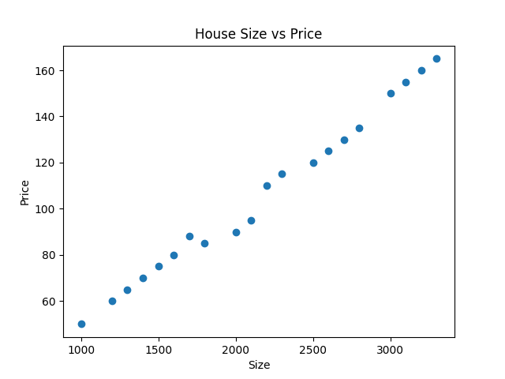

# 🏠 House Price Prediction (Machine Learning Project)

## 📌 Overview
This project predicts house prices based on:
- Size (Square Feet)
- Number of Bedrooms

It demonstrates a complete Machine Learning workflow including data preprocessing, model training, evaluation, hyperparameter tuning, and model saving.

---

## 🛠️ Technologies Used
- Python
- Pandas
- Scikit-learn
- Matplotlib
- Pickle

---

## 🧠 ML Concepts Applied
- Linear Regression
- Ridge Regression (Regularization)
- Train-Test Split
- Feature Scaling (StandardScaler)
- Hyperparameter Tuning (GridSearchCV)
- Cross Validation
- R² Score Evaluation
- Model Persistence

---

## 📊 Model Performance

Best Alpha (Ridge): `0.1`  
Cross Validation R²: `0.98+`  
Test R²: `0.98+`

The model generalizes well and avoids overfitting using regularization.

---

## 📈 Visualization

---

## 📂 Project Structure

house-price-prediction/
│
├── house_price.py
├── predict.py
├── house_price_model.pkl
├── scaler.pkl
├── price_plot.png

---

## 🔍 Example Prediction

Input:
- Size: 2000 sqft
- Bedrooms: 3

Output:
- Predicted Price ≈ 88–90 (based on dataset scale)

---

## 🚀 Future Improvements
- Use real-world housing dataset
- Add more features (location, bathrooms, age)
- Deploy using Flask or Streamlit
- Convert into REST API

---

## 👨‍💻 Author
D Ravi N
